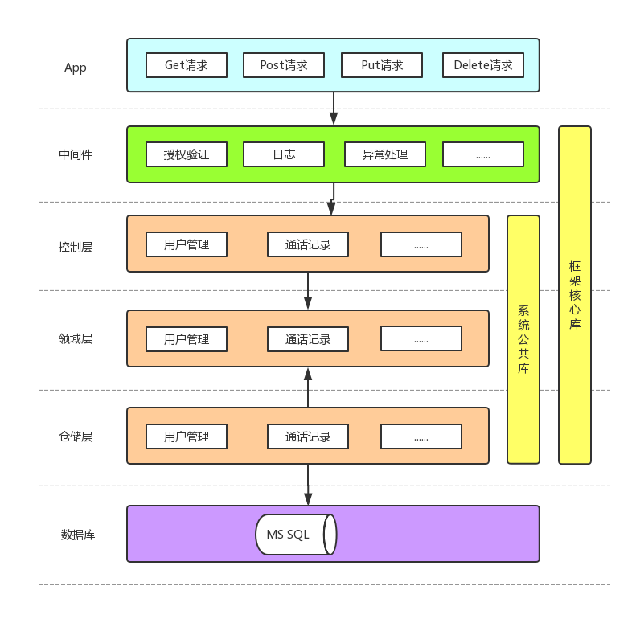

## 一些说明

> 基于ASP.Net Core 2.2和OAuth2的RESTful风格的WebAPI系统

> .Net Core学习资料：http://note.youdao.com/noteshare?id=dfe9debb2e7f4f3fe6de05a2a0493fb0

> Linux进程管理：http://note.youdao.com/noteshare?id=f80cd5bd2898bfda522f359aab3286b0

> API文档（本地部署）：http://localhost:5001/swagger/

> ~~发布后将 MyWebAPI\Host\FFmpeg 文件夹拷贝到发布目录~~

> 转换失败请检查ffmpeg文件是否有权限

> 系统架构

 

> 代码说明

1、依赖注入由构造函数改为按需实例化

2、实例化后可重复使用，无需提取变量

3、请求响应数据格式：
 ```javascript
{
    "isSuccess": true/false,
    "error": {  // isSuccess=false
        "code": "xxx",
        "message": "xxx"
    },
    "data": {}  // isSuccess=true
}
```

> 参考资料
 * [IdentityServer4官方样例](https://github.com/IdentityServer/IdentityServer4.Samples/tree/release/Quickstarts)
 * [.Net Core2的IdentityServer4使用教程](http://www.cnblogs.com/stulzq/p/7493745.html)
 * [拷贝到Linux上运行提示无效文件](https://www.iyunv.com/thread-408970-1-1.html)
